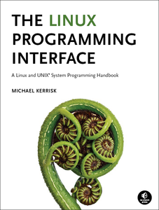

C socket code
=============
This repository contains pure C code for working with sockets on a POSIX operating
system.  There is code for both UNIX and Internet domain sockets using both stream
and datagram sockets.  For each configuration there is code for both a client and
a server.

In general I would prefer to write code in C++ as compared to C due primarily to
the vastly superior standard library, but by using pure C code, it can be used
with either a C or C++ baseline.

Further details are available within the subdirectory for each example in the
README.md there.

Attribution
-----------
This code is all based on code from the truly excellent book **The Linux Programming
Interface** (TLPI for short) by Michael Kerrisk.  If you haven't had the pleasure of being exposed to this book it is one of the best reference works I have ever seen.  Check it out:

I have renamed, refactored, and reformatted in various ways to arrive at code with
a coding style which I prefer.  I have also added some new comments and expanded
upon existing ones to make the code as self-documenting as possible.

But Mr. Kerrisk deserves kudos for writing very readable code with proper error handling
which is as simple as it can be while getting the job done.

Prerequisites
-------------
Building this code requires the following:

  * POSIX OS    - Linux, Mac OS X, or any of the BSD variants should all work fine (tested on Linux and Mac OS)
  * CMake       - version 2.6 or newer
  * C Compiler  - Any C compiler recognized by CMake with support for C99

Building
--------

cd into the directory for the example you wish to build and then do the following

    mkdir build
    cd build
    cmake ..
    make

Using
-----
See instructions within the README.md for the example you wish to run.

Goals
-----
* Simple working pure C code for socket programming
* Demonstrate proper error handling, setup, and teardown
* Work with any POSIX-based OS

Other Tools / Libraries to Consider
-----------------------------------

Depending on your needs, you may be a lot better off using a higher-level library
which abstracts away some of the intricacies (pains) of dealing with sockets.  In
particular, 0MQ / ZeroMQ is an excellent library which has many advantages over
direct socket programming:

* [0MQ](http://man7.org/tlpi/)
    * Connect your code in any language, on any platform.
    * Carries messages across inproc, IPC, TCP, TIPC, multicast
    * Smart patterns like pub-sub, push-pull, and router-dealer
